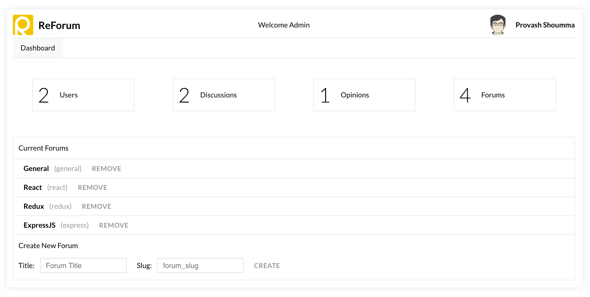

# ReForum
A minimal forum application built with the following technologies:
* [React](https://facebook.github.io/react/)
* [Redux](http://redux.js.org/)
* [ExpressJS](https://expressjs.com/)
* [PassportJS](http://passportjs.org/)
* [MongoDB](https://www.mongodb.com/)

Demo app is deployed on Heroku. Please check it out: https://reforum-app.herokuapp.com/

### Application Features
* Users can post a discussion
* Users can reply their opinions regarding discussion
* Users can favorite discussions
* Users have their own profile page
* Admin can create new forum categories
* Admin have a lot of power over every users discussions and opinions :-p

### Documentations
* [API Docs]()
* [System Overview]()

### Home View


### Admin View


## Deploy on you own server

Please make sure you have following software installed in your system:
* Node.js -
* NPM / Yarn
* Git
* MongoDB

First we need to clone the repo:
``` $ git clone https://github.com/shoumma/ReForum ```

Then we have to install the necessery dependencies using either NPM or Yarn:
``` $ npm i ```
``` $ yarn ```

Since the app currently uses GitHub authentication, we need to configure a github OAuth application. You can registar a new application from this link https://github.com/settings/developers

We need to grab the following information from the OAuth application.
* Client ID
* Client Secret
* Callback URL

The `Callback URL` is the domain where GitHub will redirect the user after a successfull login. You can use a domain name or local host. But we need to append the URL with the path `/api/user/authViaGitHub/callback`. So, the complete url will look like:
`https://localhost:8080/api/user/authViaGitHub/callback`

Now, we need to configure the credentials inside of the codebase. Open the file `config/credentials.js` add the necessery information. The file looks like this:
```js
module.exports = {
  GITHUB_CLIENT_ID: '',
  GITHUB_CLIENT_SECRET: '',
  GITHUB_CALLBACK_URL: '',
  DBURL: '',
};
```

We need to provide all the information here. You can notice that we need the database url here too. My `local` MongoDB url looks like:
``` mongodb://localhost:27017/reforum ```

Now we are ready to run the application. You can run either run the development environment of the application wich will include Hot-Reload for JS codes using Webpack and the Redux dev tool extention, or you can run the production edition. The default port for developer edition is `8080`, and for production is `process.env.PORT`.

To run the app in development environment:
``` $ npm run start:dev ```

To run the app in production environment:
``` $ npm run start ```

Now, if you visit [http://localhost:8080](http://localhost:8080) (if you ran the dev), or the production URL, you will see that the application is up and running. Congratulation! But, wait a minute, it's showing you `Sorry, coudn't find the forum`. That is because, we didn't create any forum yet. You can now sign up via github and then visit the admin panel with the url [http://localhost:8080/admin](http://localhost:8080/admin). The application is currently configured in a way that, the first user will become the admin for the system.

Here we can create new forums and that forum will be displayed in the application. The first forum will be used as default forum.

Congratulation! You now have a clone of this application in your server. :-)

## Path for Furture Work
* Add search functionality
* Add unit tests for both backend and frontend
* Ability to change the name and logo of the site from admin panel.
* Make the installation process more interactive
* Add multiple theme support.

##License
[MIT License](https://github.com/shoumma/Mister-Poster/blob/master/LICENSE). Do whatever you want to do. :-)

## Conclusion
The application is created with lots of ♥. Any pull request, issues and contribution is very appreciated. It would be really great if we can take this application to the next level, where it can be used as a platform for forums.

[Provash Shoumma](https://twitter.com/pshoumma)
